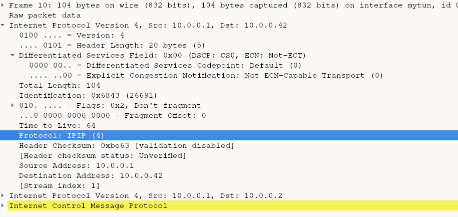
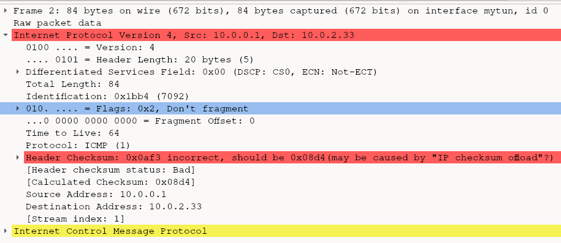

# UPDATE: 
Never got this stably to work without excessive misconfiguration of the machine. See "Conclusions"

# How to run example
1. create tun devices for client and server vpn: `bash create_named_tuntap_device.sh`
2. run client vpn server: `make vpn_client`

# Tunneling packet example
Next we try to tunnel IP in IP, by simply copying the IP header, adjusting its dest_ip and then in its payload use the old IP packet.

Also updating the length to include the header (old_packet_size + sizeof(ip_header)).

## IP header protocol
Finally, when doing test with `ping` it creates an ICMP payload which is advertised in the IP header protcol byte, which is the 9th byte.

From some test the following can be derived.

IP Header protocol values (Byte 9):
- 01 = ICMP
- 06 = TCP

With those set appropriately, wireshark will be able to interpret the nested layer. So if we do IP in IP for tunneling, we should adjust this protol header

## IP header RFC
The IP protocol Protocol is described in `RFC 791` titled `INTERNET PROTOCOL` from 1981. The IP header specifically in section 3.1:
https://datatracker.ietf.org/doc/html/rfc791#section-3.1

The summary of the content describes the protocol content:

```
 Protocol:  8 bits

     This field indicates the next level protocol used in the data portion of the internet datagram.  The values for various protocols are specified in "Assigned Numbers" [9]  
```
So it indicates the protocol in the IP-packets payload. The `"Assigned Numbers" [9]` is a reference to `RFC 790 Assigned numbers` in it is a section called `ASSIGNED INTERNET PROTOCOL NUMBERS` which contains entries for our ICMP=1 and TCP=6. Let's find a fitting one for out tunneling purposes.

According to RFC 2003 "IP Encapsulation within IP"(1996)
(source: https://www.rfc-editor.org/rfc/rfc2003.html)

Section "3.1. IP Header Fields and Handling" the protocol value 4 indicates "IP in IP".

Which has the entry:
```
4 	IPv4 	IPv4 encapsulation
```

So lets use "4" in the protocol field. Now when we encapculate an IP packet in it and inspect it via wireshark we get the following:


- The "next level protocol" is desccribed as "IPIP"
- The nested IP packet is now fully recognized
     - in its destination packet the original IP is written (here 10.0.0.2)
     - while in the encapsulating IP packet uses the hand-edited ip (that can now point to a VPN-Server doing the unpacking) here to the ip 10.0.0.42
     - It's nested payload is now recognized as just a simple ICMP (packet was generated using a `ping 10.0.0.2`)

# Problem: Packet is not forwarded
After setting up vpn_client to encapsulate incoming packets and sending them to mytun2, by using an ip in the the subnet of mytun2 as the destination ip (e.g. 10.0.2.33), it is not forwarded at all, no packet reaches it.

When directing pinging mytun2 (10.0.2.33) the packet gets reached  though.
Why is that? Why can't we emit packets from mytun to mytun2?

## Solution: IP Header Checksum?
The IP Header checksum needs to be calculated when you change anything in the header. You can see that the manipulated package (used for encapsulation) has the wrong in wireshark (needs to be enabled for the IP protocol):


But after we recalculate the header (needs to be done always, becuase of another field called "identity" which changes even for identical ping request) it sadly still doesn't deliver the package to the other mytun2 device!

# mytun -> mytun2; Still no packet!
**Problem**: Even with a correct IP checksum, the IP packets are still not delivered to mytun2 when send from mytun.

Have you wondered, why when pinging the tun devices on their own ip, the packet wouldn't show? Thats because `ip route` isn't the full story regarding routing, the kernel has also a local routing table, for its own devices

## Solution: Local routing table
When disabling the local routing entry with
`sudo ip route del local 10.0.0.1` tunneling finally works, this is a quirk only needed when running when client and host are both on the same machine.

Now you can also ping 10.0.0.1 directly and this ip-ICMP packet will reach the mytun interface! Also it will finally tunnel packets to mytun2!

Usually the local routing table is maintained by the kernel automatically and shouldn't be thus tampered with...
Readd it with:
`sudo ip route 
add to local 10.0.0.1 dev mytun`

Finally it works! ... except it doesn't

## Reverse Path filtering?
On the next day it didn't work anymore, I remember tinkering with the variable: `sysctl -a | grep net.ipv4.conf.mytun.rp_filter = 0`

What does it mean?

"When the kernel sees packets coming in that it sent out, it concludes there must be a routing loop somewhere in the network and to prevent the network from being flooded drops the packets."

Where does the kernel see packets coming in? In our vpn-client tunneling to vpn-server ip segment example, it sees the packet initially comming in from the `ping`-command process which is destined for the subnet of `mytun` and routes it there. The `mytun` backing program, `vpn-client`, encapsulated it with a destination address to mytun2 ip-subnet.

I don't think thats what happens here, as the encapsulation creates a new packet, and why wouldn't one TUN-device not be able to send packets to another?
But maybe because we're setting IP-in-IP in the protocol header, wireshark at least shows both the incoming and afterwards encapsulated packet using the same source/dest ips in its overview... so lets try to change the protocol.

TODO:
- Anyway this behaviour, i.e. dropping packets when they are destined for a interface on the same machine only to show up again is an indication of a routing issue and dropped by ther kernel. Its controlled by the kernel tunable `rp_filter`


# Conclusion (Debugging) it doesnn't work with IP-Segment-VPN-Tunneling
UPDATE: no it doesn't work, it probably work after extensive fiddling around with the tunables and the special local routing table, which is not desireable, this should work more generally. Also when testing with two machines, the packet would make it to the main interface of th emachine but never be routed from their to the tun device. ICMP request would be answered by the kernel on the incoming device, and never routed to the TUN device. When an IP in the subnet was used, that is not assigned, the sneder would cry out ARP-who-is requests and never get an answer. Spoofing the arp entry wouldn't deliver the frame.
So this approach will be given up in favor of a TCP-connection between client and server where we will pass a raw IP-Packet in the payload of a stable client-server connection. This then obviously will work more general purpose

After careful tests both of these aspects were necessary to deliver the packet from a TUN device to another (`mytun`->`mytun2`):
- recalculate IP header chechsum field => else packet gets sielently dropped!
- remove local kernel routing table for the sending TUN device

# Show IP packets getting dropped by kernel due to wrong checksum!
Source:
- https://developers.redhat.com/articles/2023/07/19/how-retrieve-packet-drop-reasons-linux-kernel
Install cli `dropwatch`, run and configure it interactively:

```sh
sudo dropwatch
nitializing null lookup method
dropwatch> set alertmode packet
Setting alert mode
Alert mode successfully set
dropwatch> start
Enabling monitoring...
Kernel monitoring activated.
Issue Ctrl-C to stop monitoring
```

# More debugging

## Dropwatch: Dropreason explanation
You can lookup the meaning behind the drop reasons from the
comments in the code here:
- https://github.com/torvalds/linux/blob/master/include/net/dropreason-core.h#L166

For example the above points to dropreason `IP_NOPROTO`, which apparently means IP is not supported.

## How to show packet stats for an interface?
`ip -stats link show <interface>`

## How to log martian packets?
enable:
`sysctl -w net.ipv4.conf.all.log_martians=1 `
view:
- `sudo journalctl -g martian`
example output:
```
Nov 22 20:55:14 sao kernel: IPv4: martian source 10.0.2.33 from 10.0.0.1, on dev mytun
Nov 22 20:55:15 sao kernel: IPv4: martian source 10.0.2.33 from 10.0.0.1, on dev mytun
Nov 22 20:55:16 sao kernel: IPv4: martian source 10.0.2.33 from 10.0.0.1, on dev mytun
Nov 22 20:55:18 sao kernel: IPv4: martian source 10.0.2.33 from 10.0.0.1, on dev mytun
Nov 22 20:55:19 sao kernel: IPv4: martian source 10.0.2.33 from 10.0.0.1, on dev mytun
```
Anyway after changing the source ip to something publicly routable like `200.1.2.3`, we don't see martian packets anymore but the packet still get dropped with reason:

`IP_NOPROTO`


## drop reason: `NETFILTER_DROP`
This is what is currently shown when we attempt to tunnel packets between TUN-devices...

## What gets dropped?
requests from any internal interface seem to get dropped:
`ping -I <interface> <mytun2-subnet-ip>`

But why?
