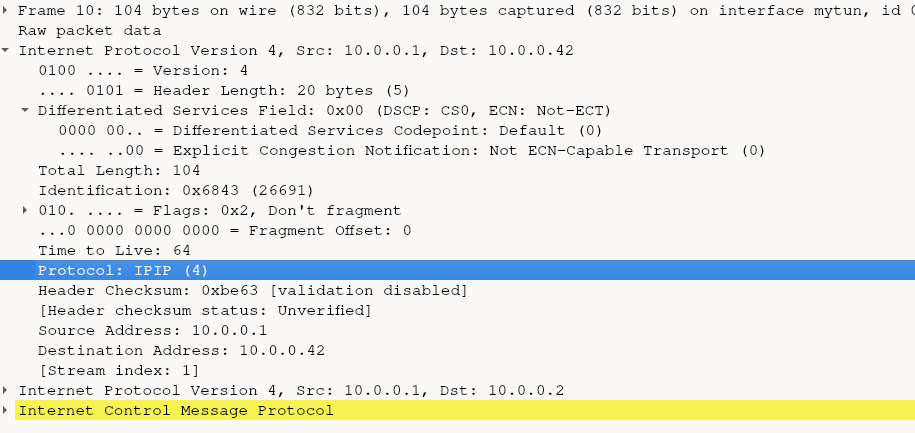

# Tunneling packet example
Next we try to tunnel IP in IP, by simply copying the IP header, adjusting its dest_ip and then in its payload use the old IP packet.

Also updating the length to include the header (old_packet_size + sizeof(ip_header)).

## IP header protocol
Finally, when doing test with `ping` it creates an ICMP payload which is advertised in the IP header protcol byte, which is the 9th byte.

From some test the following can be derived.

IP Header protocol values (Byte 9):
- 01 = ICMP
- 06 = TCP

With those set appropriately, wireshark will be able to interpret the nested layer. So if we do IP in IP for tunneling, we should adjust this protol header

## IP header RFC
The IP protocol Protocol is described in `RFC 791` titled `INTERNET PROTOCOL` from 1981. The IP header specifically in section 3.1:
https://datatracker.ietf.org/doc/html/rfc791#section-3.1

The summary of the content describes the protocol content:

```
 Protocol:  8 bits

     This field indicates the next level protocol used in the data portion of the internet datagram.  The values for various protocols are specified in "Assigned Numbers" [9]  
```
So it indicates the protocol in the IP-packets payload. The `"Assigned Numbers" [9]` is a reference to `RFC 790 Assigned numbers` in it is a section called `ASSIGNED INTERNET PROTOCOL NUMBERS` which contains entries for our ICMP=1 and TCP=6. Let's find a fitting one for out tunneling purposes.

According to RFC 2003 "IP Encapsulation within IP"(1996)
(source: https://www.rfc-editor.org/rfc/rfc2003.html)

Section "3.1. IP Header Fields and Handling" the protocol value 4 indicates "IP in IP".

Which has the entry:
```
4 	IPv4 	IPv4 encapsulation
```

So lets use "4" in the protocol field. Now when we encapculate an IP packet in it and inspect it via wireshark we get the following:


- The "next level protocol" is desccribed as "IPIP"
- The nested IP packet is now fully recognized
     - in its destination packet the original IP is written (here 10.0.0.2)
     - while in the encapsulating IP packet uses the hand-edited ip (that can now point to a VPN-Server doing the unpacking) here to the ip 10.0.0.42
     - It's nested payload is now recognized as just a simple ICMP (packet was generated using a `ping 10.0.0.2`)