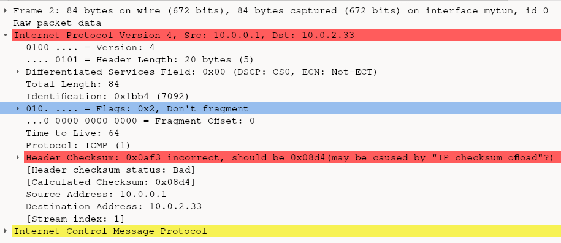

# How to run example
1. create tun devices for client and server vpn: `bash create_named_tuntap_device.sh`
2. run client vpn server: `make vpn_client`

# Tunneling packet example
Next we try to tunnel IP in IP, by simply copying the IP header, adjusting its dest_ip and then in its payload use the old IP packet.

Also updating the length to include the header (old_packet_size + sizeof(ip_header)).

## IP header protocol
Finally, when doing test with `ping` it creates an ICMP payload which is advertised in the IP header protcol byte, which is the 9th byte.

From some test the following can be derived.

IP Header protocol values (Byte 9):
- 01 = ICMP
- 06 = TCP

With those set appropriately, wireshark will be able to interpret the nested layer. So if we do IP in IP for tunneling, we should adjust this protol header

## IP header RFC
The IP protocol Protocol is described in `RFC 791` titled `INTERNET PROTOCOL` from 1981. The IP header specifically in section 3.1:
https://datatracker.ietf.org/doc/html/rfc791#section-3.1

The summary of the content describes the protocol content:

```
 Protocol:  8 bits

     This field indicates the next level protocol used in the data portion of the internet datagram.  The values for various protocols are specified in "Assigned Numbers" [9]  
```
So it indicates the protocol in the IP-packets payload. The `"Assigned Numbers" [9]` is a reference to `RFC 790 Assigned numbers` in it is a section called `ASSIGNED INTERNET PROTOCOL NUMBERS` which contains entries for our ICMP=1 and TCP=6. Let's find a fitting one for out tunneling purposes.

According to RFC 2003 "IP Encapsulation within IP"(1996)
(source: https://www.rfc-editor.org/rfc/rfc2003.html)

Section "3.1. IP Header Fields and Handling" the protocol value 4 indicates "IP in IP".

Which has the entry:
```
4 	IPv4 	IPv4 encapsulation
```

So lets use "4" in the protocol field. Now when we encapculate an IP packet in it and inspect it via wireshark we get the following:


- The "next level protocol" is desccribed as "IPIP"
- The nested IP packet is now fully recognized
     - in its destination packet the original IP is written (here 10.0.0.2)
     - while in the encapsulating IP packet uses the hand-edited ip (that can now point to a VPN-Server doing the unpacking) here to the ip 10.0.0.42
     - It's nested payload is now recognized as just a simple ICMP (packet was generated using a `ping 10.0.0.2`)

# Problem: Packet is not forwarded
After setting up vpn_client to encapsulate incoming packets and sending them to mytun2, by using an ip in the the subnet of mytun2 as the destination ip (e.g. 10.0.2.33), it is not forwarded at all, no packet reaches it.

When directing pinging mytun2 (10.0.2.33) the packet gets reached  though.
Why is that? Why can't we emit packets from mytun to mytun2?

## Solution: IP Header Checksum?
The IP Header checksum needs to be calculated when you change anything in the header. You can see that the manipulated package (used for encapsulation) has the wrong in wireshark (needs to be enabled for the IP protocol):


But after we recalculate the header (needs to be done always, becuase of another field called "identity" which changes even for identical ping request) it sadly still doesn't deliver the package to the other mytun2 device!

# mytun -> mytun2; Still no packet!
**Problem**: Even with a correct IP checksum, the IP packets are still not delivered to mytun2 when send from mytun.

Have you wondered, why when pinging the tun devices on their own ip, the packet wouldn't show? Thats because `ip route` isn't the full story regarding routing, the kernel has also a local routing table, for its own devices

## Solution: Local routing table
When disabling the local routing entry with
`sudo ip route del local 10.0.0.1` tunneling finally works, this is a quirk only needed when running when client and host are both on the same machine.

Now you can also ping 10.0.0.1 directly and this ip-ICMP packet will reach the mytun interface! Also it will finally tunnel packets to mytun2!

Usually the local routing table is maintained by the kernel automatically and shouldn't be thus tampered with...
Readd it with:
`sudo ip route 
add to local 10.0.0.1 dev mytun`

Finally it works!

# Conclusion (Debugging)
After careful tests both of these aspects were necessary to deliver the packet from a TUN device to another (`mytun`->`mytun2`):
- recalculate IP header chechsum field => else packet gets sielently dropped!
- remove local kernel routing table for the sending TUN device

# Show IP packets getting dropped by kernel due to wrong checksum!
TODO
